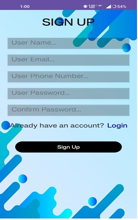
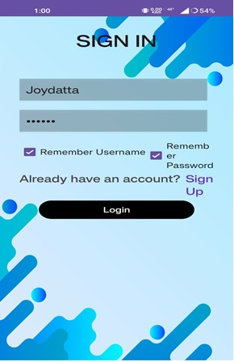
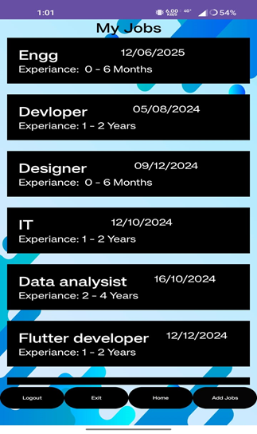
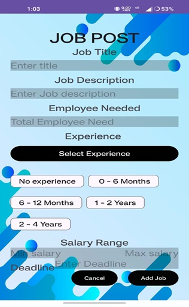
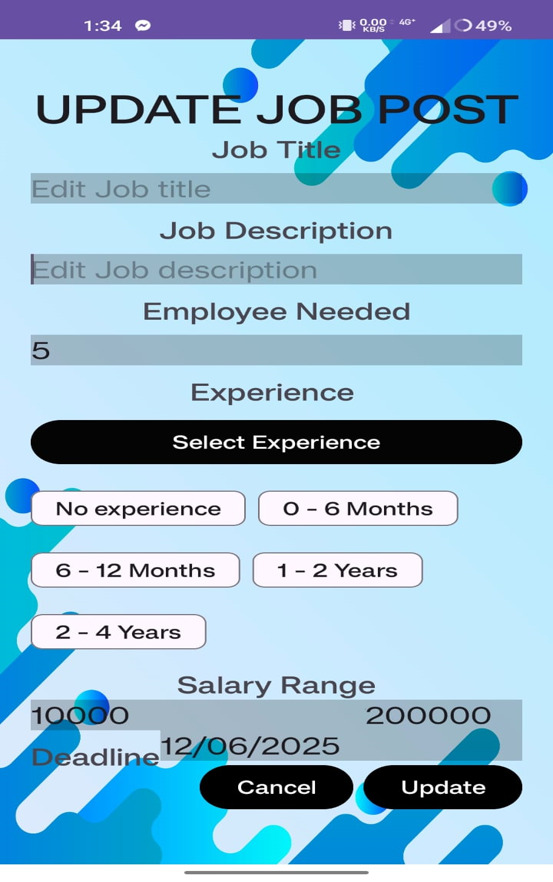
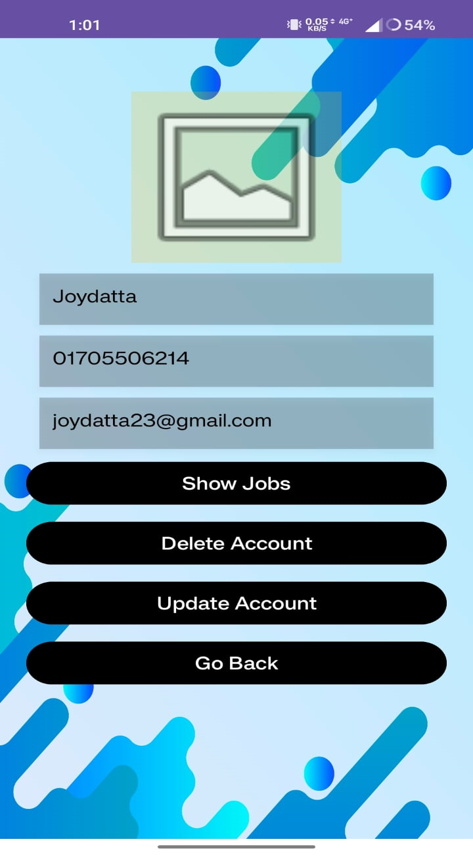
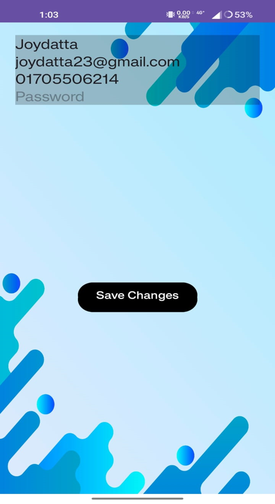

# Man_Power_Supply

**Overview** 

The Man Power Supply App is a comprehensive solution that streamlines the job posting and application process. It provides a forum for employers to publish job openings and job seekers to discover suitable employment.
 

**Components**
 

Database Helper:   Oversees the creation, updating, and retrieval of jobs-related data. Manages user information, such as login credentials, profile modifications, and user registration.

**Activities:**

1.	Login & Signup Activity:  Handle user authentication
     
      
    
2.  JobListingsActivity :  Displaying homepage with all users jobs.

    
      

3. JobDetailActivity: Displays detailed information about a specific job.

    
      

4. JobPosting:  Clicking any item shows Job detail activity.

    
      

5. Update Job Activity: If user selects 'Update', Update job post activity appears without 'Cancel' or 'Update' buttons.

    
      

6.  UserProfile & UpdateProfileActivity: Manage user profiles.

     
      

7.  MyJobDetailActivity & MyJobsListingActivity: Employers to manage their own postings.

     
      

**Features**

1. **User authentication:** safe procedures for signing up and logging in.
2. **Job Management:** Job postings can be added, updated, or removed by employers.
3. **Profile Management:** users can modify their profiles.
4. Browsing: Users can peruse and submit applications for jobs.
5. **Real-time Updates:** The software makes sure that the data it displays is current.

**App Limitations**

1.	Implementation of multithreading.
2.	Advanced search and sorting capabilities.
3.	Massaging capability is available in-app.
4.	Reviews and evaluations.
5.	Panel for monitoring job performance that provides insights and data analysis.

**Algorithm and Management of Data**

1. Data is stored in SQLite, and structured queries are used to manipulate the data. 
2. Data display and interactions are handled by custom logic in adapters and activities.

**Business Model/Revenue Strategy**

	**Advertisement-Driven Revenue:** The app makes revenue by displaying advertisements and charging per impression or click.
	**Subscription Model:** Users can pay to remove ads for asset period of time, which improve their experience.
	**Premium Listings:** Employers can pay to have their job postings highlighted or featured.
	**Data Analytics:** Aggregate non-personal data can be used to provide market insights, which can be sold to interested businesses or researchers. 

**Inspirations**

	**Identifying a Need:** We noticed a market gap for a platform that effortlessly connects job seekers with employers.
	**Ease of Access:** We wanted to design a solution that was easily accessible to everyone, which led to the development of an Android app.
	**Empowerment:** Our goal was to provide folks with tools to help them manage their work path.
	**Community Building:** We envisioned a platform that builds a community of employers and job seekers that help one other succeed.
	**Innovation:** We were driven to create and contribute to the technology sector by create a one-of-a-kind and beneficial application.
  
**Future Developments**

**Implementation of Threading:** To improve performance and user experience, especially for database operations and potentially network requests. 

**Advanced Search and Filters:** Allows users to easily find suitable job ads.

**In-App Messaging:** To facilitate communication between employers and applicants. 

**Feedback and Ratings:** Help both employers and employees create trust in the platform.

**Integration with External Services:** Examples Include LinkedIn for professional profiles and Google Maps for job location visibility.

**Reporting and Analytics Dashboard:** For employers to track the performance of their job postings.

**In summary**

An effective platform that meets the critical demand for effective job postings and applications is the Man Power Supply App. Its current features along with the suggested improvements have the potential to greatly expedite the hiring process across multiple industries. By emphasising premium services and adverts, the business model guarantees a steady flow of income while providing value to its users. 

